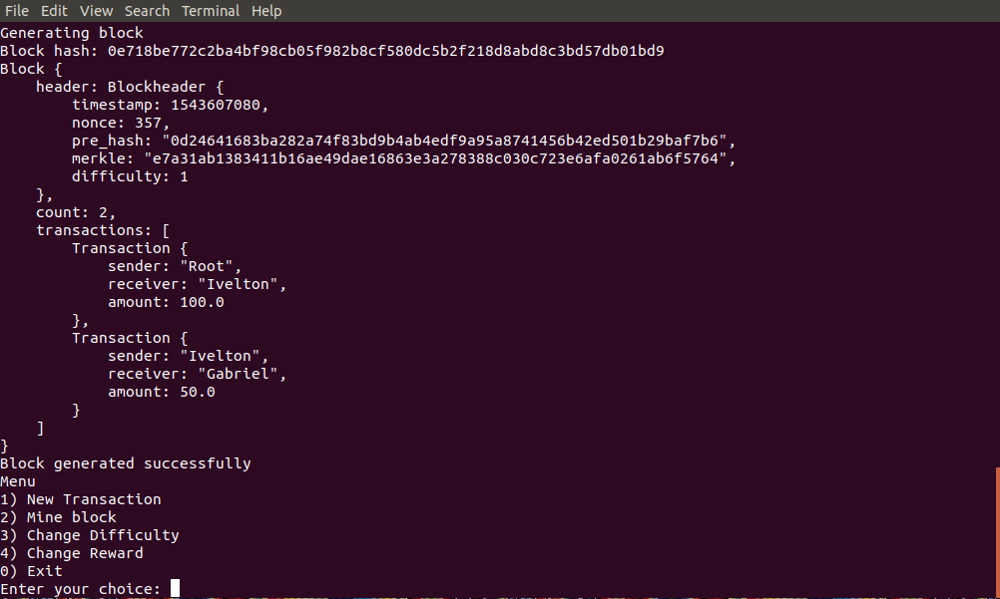

# A Simple blockchain Rust Implementation

- Terminal client
- Blocks, Blockchain
- SHA256
- Merkle Tree
- Mining
- Add Transactions
- Mine Blocks
- Change Difficulty
- Change Reward

* from tensor programming tutorial.
